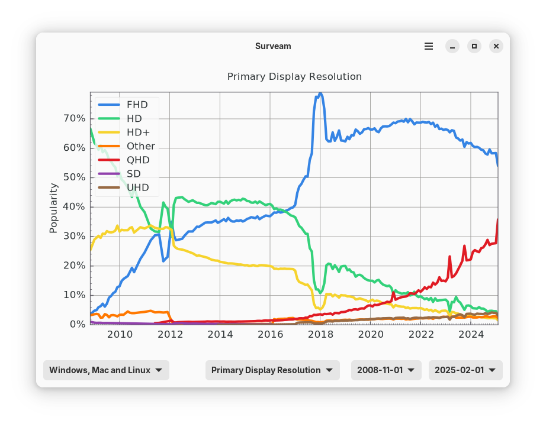
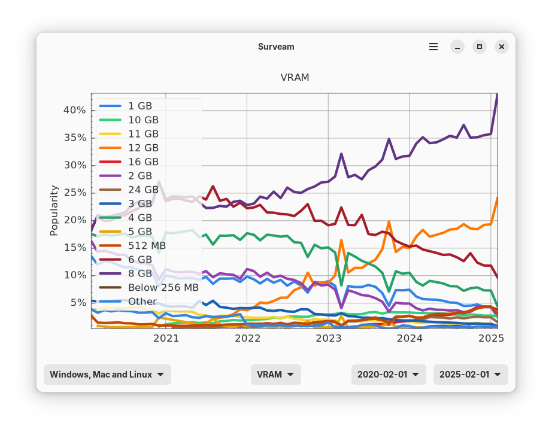

   # Surveam

  Visualize Steam Hardware & Software Survey data through time

  
  

## Libraries used
  - [PyGObject](https://pygobject.gnome.org/)
  - [pandas](https://pandas.pydata.org/)
  - [Matplotlib](https://matplotlib.org/)

## Special thanks

  - Valve (and Steam users) for the [survey data](https://store.steampowered.com/hwsurvey)
  - Jan Degener for [collecting data from since 2010](https://github.com/jdegene/steamHWsurvey)
  - Dmytro Bulatov for [mapping GPU names to architecture names](https://github.com/Devaniti/SteamHWSurveyGPUArchStats)
  - [Graphs developers](https://gitlab.gnome.org/World/Graphs) for the matplotlib Adwaita styles

